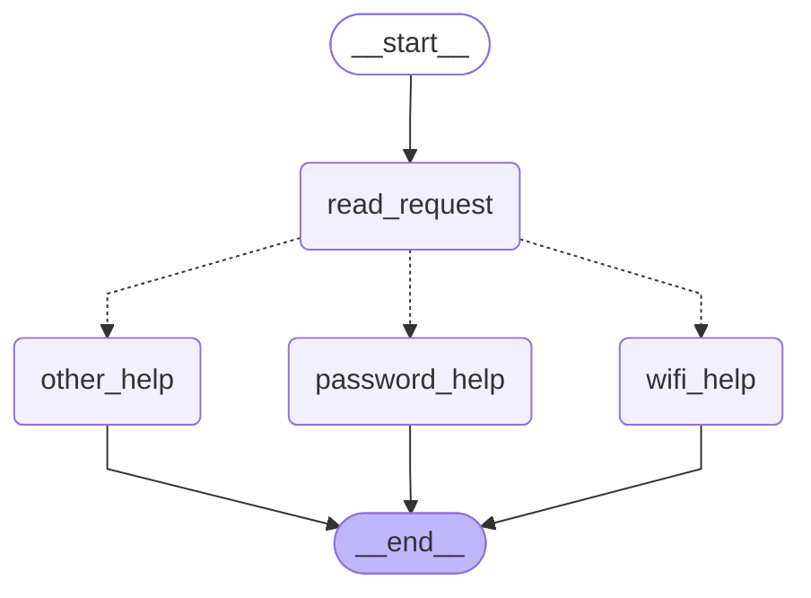
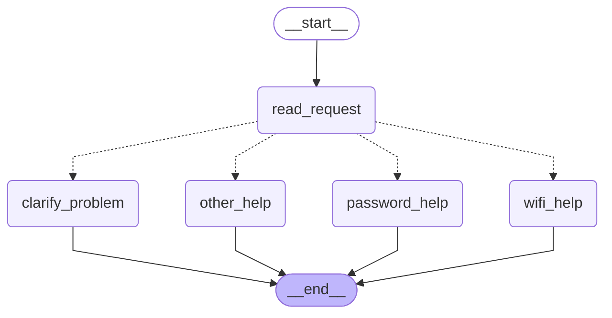
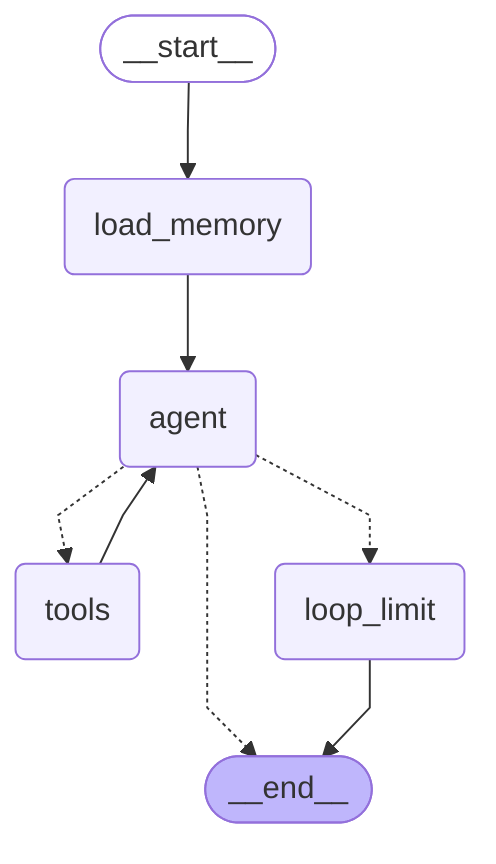

# Graphs drawn by LangGraph (`python -m helpdesk graphs`)

## Part 1 - original

```mermaid
---
config:
  flowchart:
    curve: linear
---
graph TD;
	__start__([<p>__start__</p>]):::first
	read_request(read_request)
	wifi_help(wifi_help)
	password_help(password_help)
	other_help(other_help)
	__end__([<p>__end__</p>]):::last
	__start__ --> read_request;
	read_request -.-> other_help;
	read_request -.-> password_help;
	read_request -.-> wifi_help;
	other_help --> __end__;
	password_help --> __end__;
	wifi_help --> __end__;
	classDef default fill:#f2f0ff,line-height:1.2
	classDef first fill-opacity:0
	classDef last fill:#bfb6fc
```

## Part 1 - with_clarification

```mermaid
---
config:
  flowchart:
    curve: linear
---
graph TD;
	__start__([<p>__start__</p>]):::first
	read_request(read_request)
	wifi_help(wifi_help)
	password_help(password_help)
	other_help(other_help)
	clarify_problem(clarify_problem)
	__end__([<p>__end__</p>]):::last
	__start__ --> read_request;
	read_request -.-> clarify_problem;
	read_request -.-> other_help;
	read_request -.-> password_help;
	read_request -.-> wifi_help;
	clarify_problem --> __end__;
	other_help --> __end__;
	password_help --> __end__;
	wifi_help --> __end__;
	classDef default fill:#f2f0ff,line-height:1.2
	classDef first fill-opacity:0
	classDef last fill:#bfb6fc
```

## Parts 2-3 - model and tools loop

```mermaid
---
config:
  flowchart:
    curve: linear
---
graph TD;
	__start__([<p>__start__</p>]):::first
	load_memory(load_memory)
	agent(agent)
	tools(tools)
	loop_limit(loop_limit)
	__end__([<p>__end__</p>]):::last
	__start__ --> load_memory;
	agent -.-> __end__;
	agent -.-> loop_limit;
	agent -.-> tools;
	load_memory --> agent;
	tools --> agent;
	loop_limit --> __end__;
	classDef default fill:#f2f0ff,line-height:1.2
	classDef first fill-opacity:0
	classDef last fill:#bfb6fc
```
